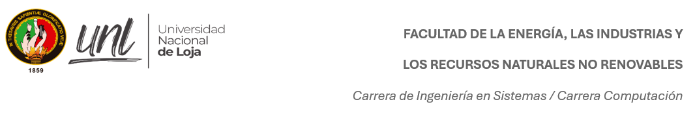

# 🏛️ UNIVERSIDAD NACIONAL DE LOJA  

## ⚡ Facultad de la Energía, las Industrias y los Recursos Naturales No Renovables  

### 💻 Carrera: **Computación**  
📚 Asignatura: **Teoría de la Distribución y la Probabilidad**  
🎓 Nivel: **Segundo ciclo**  
🗓️ Período académico: **Abril – Agosto 2026**  

---
👩‍🏫 Docente: **Ing. Cristian Narváez**

🧑‍🎓 Estudiante: **Alison Tapia**

---

➡️ [**Ir al índice**](/index.md)
